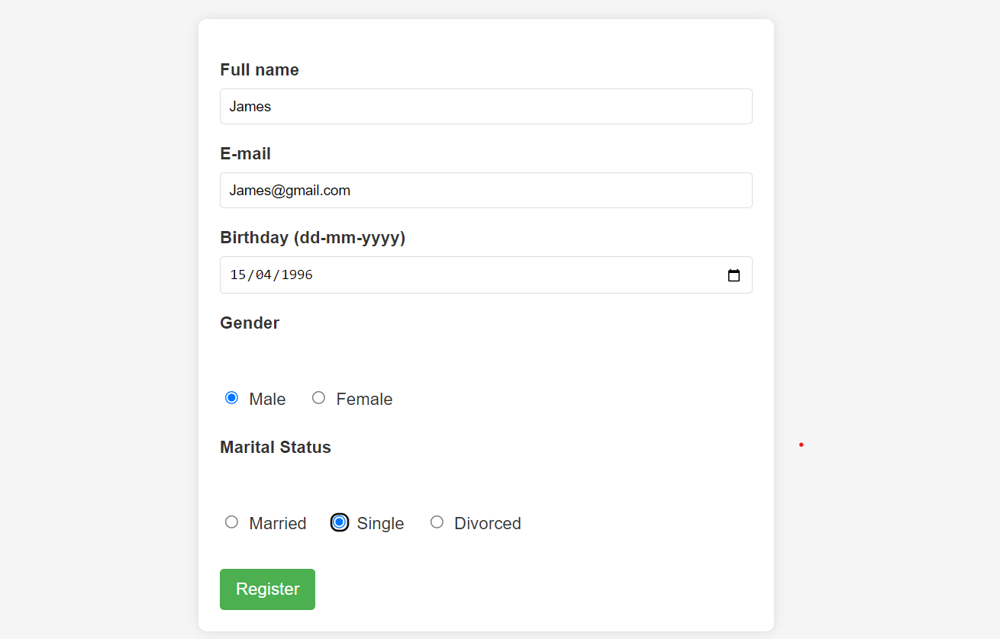
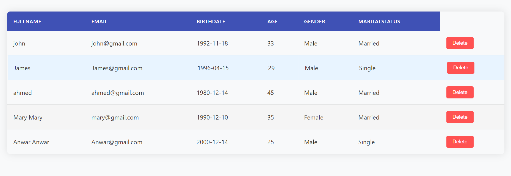

# JEE Person Manager

A simple Java EE web application demonstrating CRUD operations  on a `Person` entity using:
- MVC Design Pattern
- JDBC for database access
- JSP & JSTL for views
- Apache Tomcat 10.01 as the server

## 🛠 Technologies Used

- Java EE (Servlets, JSP+JSTL,Models)
- JDBC
- MySQL 
- Apache Tomcat 10.01
- HTML,CSS,JS

### Add New Person

### List of Persons

